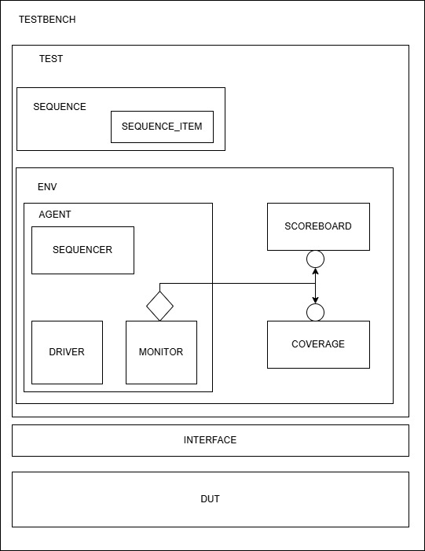

#  Serial IPs with Advanced UVM Verification Suite

This repository features a collection of robust, synthesizable serial communication protocol IPs (UART, SPI, I2C) designed at the Register Transfer Level (RTL) and thoroughly verified using an enterprise-grade **Universal Verification Methodology (UVM) 1.2** framework.

The primary objective of this project is to demonstrate commercial-grade hardware design predictability and a rigorous top-down verification architecture utilizing asynchronous dynamic transaction tracking.

---

##  1. Supported IP Cores & Technical Specifications

Detailed hardware architectures, FSM charts, and waveform proofs for each IP are isolated in their respective specification documents to maintain high documentation scalability. Click on the IP name or the spec link to view its detailed datasheet.

| IP Core | Status | Key Features | Verification Framework | Detailed Specification |
| :--- | :---: | :--- | :---: | :---: |
| **UART** | 🟢 Verified | 8-N-1 Frame, 16x Oversampling RX, Independent FSMs | UVM 1.2 (0 Errors) | [Read UART Spec](./docs/uart/README.md) |
| **SPI** | ⏳ WIP | Master/Slave, Configurable CPOL/CPHA, Programmable Clock | Planned | Coming Soon |
| **I2C** | ⏳ WIP | Multi-Master/Slave, 7-bit Addressing, Standard/Fast Mode | Planned | Coming Soon |

---

##  2. Common UVM Testbench Architecture

All digital communication IPs within this repository share a highly unified, reusable, top-down UVM architecture. The testbench subsystem leverages constraint-random stimulus generation, TLM analysis ports, and asynchronous FIFO-based scoreboards to guarantee absolute data integrity under multi-iteration stress conditions.


*(Note: Component classes such as Sequencer Items, Drivers, Monitors, and Scoreboard Predictors are polymorphically overridden to match each specific serial protocol.)*

---

##  3. Repository Directory Structure

```text
02_Serial_IPs_with_UVM/
├── rtl/                        # Design Under Test (DUT) Sources
│   └── uart/                   # UART RTL hardware blocks
├── verif/                      # UVM Verification IP (VIP) Suite
│   └── uart_env/               # Integrated UVM component classes
├── sim/                        # Simulation & Build Automation Infrastructure
│   └── uart/                   # Build scripts, filelists, and trace logs
└── docs/                       # Technical Specifications & Documentation Assets
    ├── images/                 # Common system and testbench architecture maps
    └── uart/                   # UART specific visual diagrams and specifications
