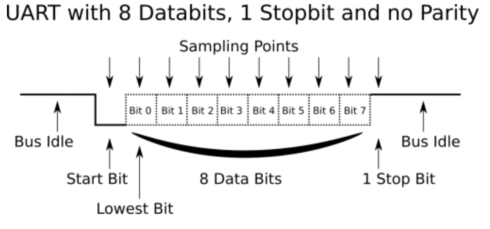
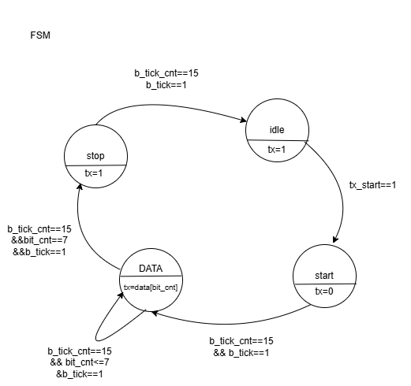
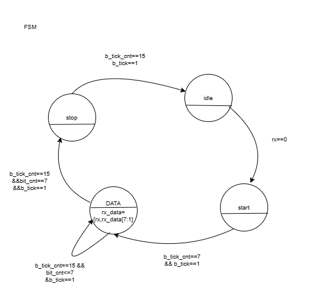
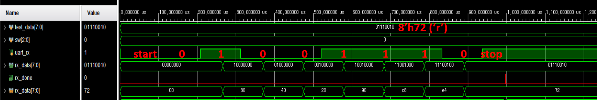

# 📡 UART IP Core Technical Specification & Verification Report

This document provides the exhaustive hardware architectural specifications, interface definitions, finite state machine (FSM) controls, and physical waveform proofs for the custom-designed standalone UART IP Core.

---

## 1. Technical Specifications & Framing Format

The Custom UART core utilizes an asynchronous serial data transmission protocol. It incorporates an industrial-grade oversampling receiver to achieve high noise immunity and timing margin robustness against potential baud rate drift.

* **Target Operating Frequency:** 100 MHz (Configurable via parameters)
* **Data Width:** 8-bit Serial-to-Parallel and Parallel-to-Serial conversion.
* **Framing Configuration:** 1 Start bit (Low), 8 Data bits (LSB-first), 1 Stop bit (High), No Parity.

### 1.1. Baud Rate Generation (Oversampling Tick)
To synchronize with incoming asynchronous data, a dedicated Baud Rate Generator (`baud_tick.sv`) creates a tick pulse exactly 16 times the target baud rate. The internal Modulo-N counter wraps around based on the following calculation:
> **Modulo-N (Tick Period) = System Clock Frequency / (Target Baud Rate * 16)**

---

## 2. Standalone Core Interface & Parameters

Currently, this IP operates as a standalone physical core (unwrapped). System-bus wrappers (e.g., APB / AXI4-Lite) and memory-mapped registers are planned for the next integration phase.

### 2.1. Parameter Map
| Parameter Name | Default Value | Description |
| :--- | :---: | :--- |
| `DBIT` | 8 | Number of data bits per frame |
| `SB_TICK` | 16 | Number of ticks for Stop bit (16 ticks = 1 stop bit) |
| `D_WIDTH` | 8 | Width of the data bus |

### 2.2. Port Map (`uart_top.sv`)
| Port Name | Direction | Width | Description |
| :--- | :---: | :---: | :--- |
| `clk` | Input | 1 | System clock (e.g., 100MHz) |
| `rst_n` | Input | 1 | Active-low asynchronous reset |
| `rx` | Input | 1 | Asynchronous serial data receive line |
| `tx` | Output | 1 | Asynchronous serial data transmit line |
| `tx_start` | Input | 1 | Trigger pulse to initiate data transmission |
| `tx_data` | Input | 8 | Parallel payload data to be transmitted |
| `rx_done` | Output | 1 | Pulses High for 1 clock cycle upon successful byte reception |
| `rx_data` | Output | 8 | Received parallel payload data |

---

## 3. Hardware Finite State Machine (FSM) Design

For complete hardware decoupling, the design implements fully independent Moore-type FSMs for the transmitter and receiver.

### 3.1. UART Transmitter (TX) FSM
Upon receiving the `tx_start` signal, the FSM sequentially drives the start bit, shifts out 8 data bits from the internal buffer, appends the high stop bit, and cleanly drives the line back to the Idle state (`tx=1`).

### 3.2. UART Receiver (RX) FSM
The receiver continuously polls for a valid Start bit falling edge. Once detected, it utilizes the 16x oversampling counter (`b_tick_cnt`) to wait for 7 ticks, placing the sampling point precisely at the theoretical center of the symbol window.

---

## 4. UVM Verification Strategy & Results

The verification environment ensures absolute data integrity using a Constraint-Random Verification (CRV) methodology. 

### 4.1. UVM Transaction (Sequence Item)
The core of the verification stimulus is the `uart_sequence_item`, which dynamically generates constraint-random payloads.
* `rand bit [7:0] data_payload;` // The 8-bit data to be transmitted.
* `rand int delay_cycles;` // Randomized inter-transaction gaps to stress the FSM transitions.

### 4.2. Test Scenarios & Scoreboard Predictor
* **Randomized Payload Generation:** The UVM Sequencer generates constraint-random payloads, passing them to the Driver.
* **Transaction Matching:** The `uart_scoreboard` employs asynchronous FIFOs to capture expected transactions directly from the monitor and compares them against actual transactions captured by the physical line monitors.
* **Test Iterations:** The base test successfully executed **10 consecutive random RX operations** followed by **10 consecutive random TX operations** without any data loss, misalignment, or FIFO overflow.

### 4.3. Hardware Timing Verification (Waveform Proof)
The trace log below visualizes the transmission and reception of an 8-bit payload (`8'h72`, ASCII 'r'). It explicitly demonstrates the exact bit-shifting intervals, internal register updates matching the LSB-first rule, and the successful execution of the receive cycle.

---

## 5. Future Integration Roadmap

* **System Bus Wrapper:** Integrate an **AXI4-Lite** or **APB** interface wrapper to enable memory-mapped I/O (MMIO) register control (Baud rate config, status polling).
* **Protocol Assertions:** Embed **SystemVerilog Assertions (SVA)** within the virtual interface to continuously monitor physical line legality.

---
[⬅ Return to Top-Level Dashboard](../../README.md)
