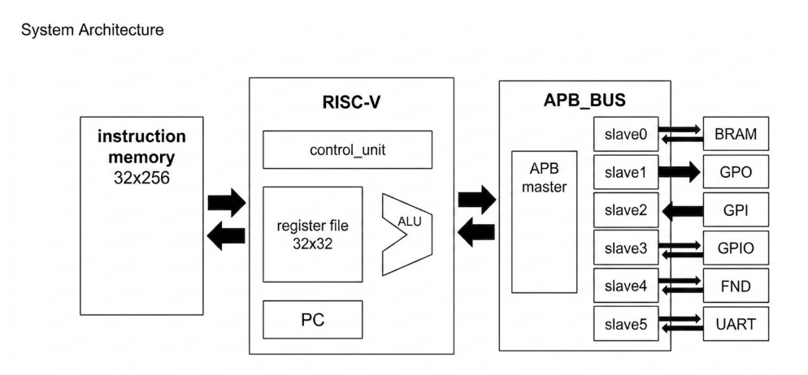

# RV32I Multi-cycle Core with AMBA 3 APB Bus SoC

## 1. Overview
This repository provides the RTL design and baseline verification environment for a custom 32-bit RISC-V (RV32I base integer instruction set) multi-cycle processor. The core is integrated with an AMBA 3 APB bus to communicate with memory-mapped peripherals, demonstrating a complete System-on-Chip (SoC) architecture.

## 2. Directory Structure
* `rtl/` : Synthesizable SystemVerilog/Verilog source codes (Core, Bus, Peripherals).
* `sw/` : Compiled firmware binaries (`.mem`) for HW/SW co-simulation.
* `docs/` : System architecture diagrams, FSM charts, and verification waveforms.

## 3. System Architecture
The hardware architecture is divided into the execution core, the bus interface, and the peripheral IPs.
* Core: 5-stage multi-cycle execution unit. Instruction latching is implemented at the Fetch stage to optimize the critical path.
* Bus: AMBA 3 APB protocol (1 Master, Multiple Slaves).
* Peripherals: UART (Configurable baud rate), GPIO, 7-Segment Controller, BRAM.

## 4. System Memory Map
The address decoder allocates the following address spaces. The hardware decodes `addr[31:28]` for the main memory region and `addr[15:12]` for specific APB slaves.

| Peripheral | Base Address | Size | Access | Description |
| :--- | :--- | :--- | :--- | :--- |
| RAM | 0x1000_0000 | 4KB | R/W | Instruction and Data Memory |
| APB_GPO | 0x2000_0000 | 4KB | W | General Purpose Output Control |
| APB_GPI | 0x2000_1000 | 4KB | R | General Purpose Input Read |
| APB_GPIO | 0x2000_2000 | 4KB | R/W | Bidirectional I/O Control |
| APB_FND | 0x2000_3000 | 4KB | W | 7-Segment Display Data Register |
| APB_UART | 0x2000_4000 | 4KB | R/W | UART TX/RX Data & Status/Control |

## 5. FPGA Implementation (Baseline)
Target Device: Xilinx Artix-7 (xc7a35tcpg236-1) on Digilent Basys3.
*Note: The following metrics represent a baseline synthesis result without aggressive area/timing constraints.*

| Resource | Utilization | Available | Utilization % |
| :--- | :--- | :--- | :--- |
| LUT | [Fill_Here] | 20,800 | - % |
| FF | [Fill_Here] | 41,600 | - % |
| BRAM | [Fill_Here] | 50 | - % |

## 6. Verification & Documentation
Detailed verification results (HW/SW Co-simulation waveforms) and FSM architectures can be found in the [docs directory](./docs/).
