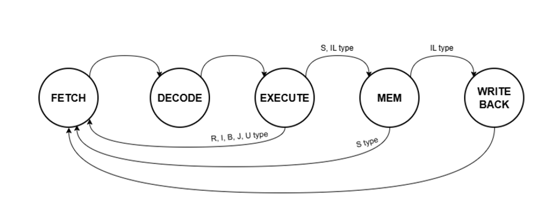

# RV32I Multi-cycle Core with AMBA 3 APB Bus SoC

## 1. Overview
This repository provides the RTL design and verification environment for a custom 32-bit RISC-V (RV32I base integer instruction set) multi-cycle processor. The core is integrated with an AMBA 3 APB bus to communicate with memory-mapped peripherals, demonstrating a complete System-on-Chip (SoC) architecture.

## 2. System Architecture
The hardware architecture is divided into the execution core, the bus interface, and the peripheral IPs.
* Core: 5-stage multi-cycle execution unit (Fetch, Decode, Execute, Memory, Write-back). Instruction latching is implemented at the Fetch stage to optimize the critical path and ensure timing stability.
* Bus: AMBA 3 APB protocol (1 Master, Multiple Slaves).
* Peripherals: UART (Configurable baud rate with shadow registers), GPIO, 7-Segment Display Controller, BRAM.

### 2.1. Top-Level Block Diagram

### 2.2. CPU Core FSM Logic
The processor internal controller governs execution using the following state transition sequence to optimize the critical timing path.

## 3. System Memory Map
The address decoder within the APB master allocates the following address spaces for each slave IP. The hardware decodes `addr[31:28]` for the main memory region and `addr[15:12]` for specific APB slaves. All transactions are 32-bit aligned.

| Peripheral | Base Address | Size | Access | Description |
| :--- | :--- | :--- | :--- | :--- |
| RAM | 0x1000_0000 | 4KB | R/W | Instruction and Data Memory |
| APB_GPO | 0x2000_0000 | 16B | W | General Purpose Output Control |
| APB_GPI | 0x2000_1000 | 16B | R | General Purpose Input Read |
| APB_GPIO | 0x2000_2000 | 16B | R/W | Bidirectional I/O Control |
| APB_FND | 0x2000_3000 | 16B | W | 7-Segment Display Data Register |
| APB_UART | 0x2000_4000 | 16B | R/W | UART TX/RX Data & Status/Control |

## 4. Verification (HW/SW Co-simulation)
Standard unit-level testbenches are replaced with a system-level hardware/software co-simulation methodology.
* Compiled C/Assembly firmware binaries (`.mem`) are loaded into the instruction memory.
* The RV32I core fetches instructions, executes them, and performs bus transactions to peripheral addresses.
* Protocol compliance and functional correctness are verified via Vivado Simulator.

### 4.1. AMBA APB UART Interface Transaction

### 4.2. Memory-Mapped GPIO Operation

## 5. FPGA Implementation
Target Device: Xilinx Artix-7 (xc7a35tcpg236-1) on Digilent Basys3.

| Resource | Utilization | Available | Utilization % |
| :--- | :--- | :--- | :--- |
| LUT | [Fill_Here] | 20,800 | - % |
| FF | [Fill_Here] | 41,600 | - % |
| BRAM | [Fill_Here] | 50 | - % |

## 6. Reference
For detailed FSM design and operational analysis, refer to the project datasheet:
* [RV32I_APB_Custom_SoC_Presentation.pptx](./docs/RISC-V_multi-cycle_APB_bus_(2).pptx)
